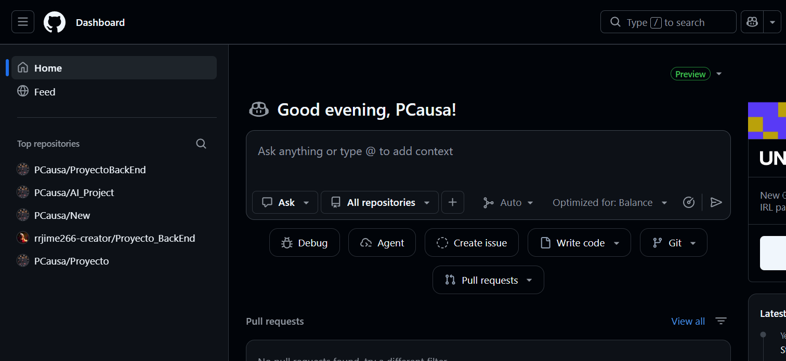
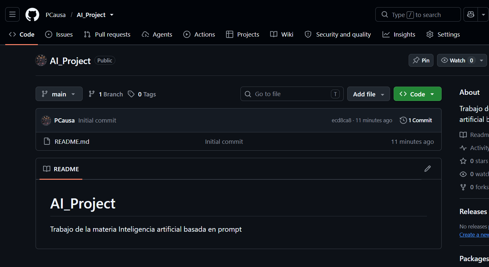
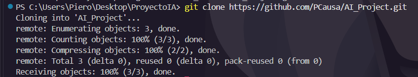
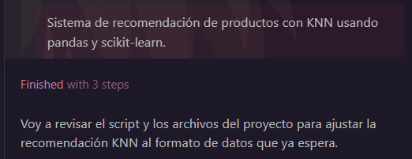
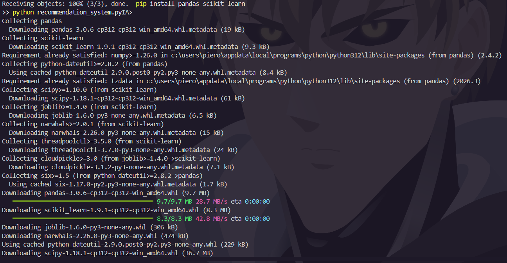
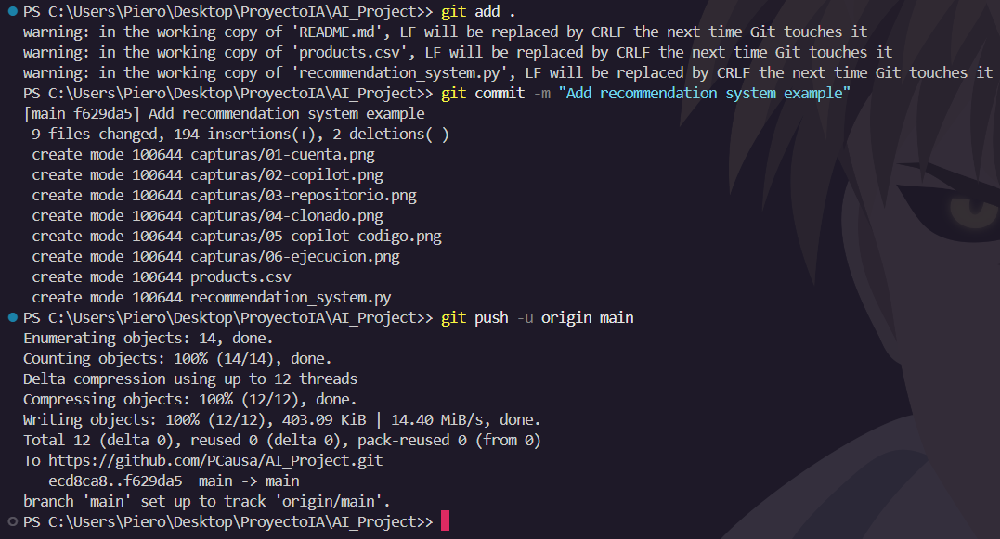

# AI_Project – Sistema de recomendación con GitHub Copilot

**Estudiante:** Jhanpiero Alfaro
**Asignatura / Sección:** Inteligencia artificial basada en prompt.
**Institución:** INACAP
**Fecha:** 03-10-2026

## Objetivo

Explorar las tendencias emergentes en inteligencia artificial usando GitHub Copilot como herramienta práctica, generando con su ayuda un sistema de recomendación de productos en Python.

## Contenido del repositorio

| Archivo | Descripción |
|---|---|
| `recommendation_system.py` | Sistema de recomendación basado en K vecinos más cercanos (KNN). |
| `products.csv` | Dataset de ejemplo con 36 productos, 3 características y su etiqueta. |
| `README.md` | Documentación del proceso. |
| `capturas/` | Capturas de pantalla de cada paso. |

## Proceso seguido

### 1. Creación de la cuenta en GitHub

Ingresé a https://github.com, seleccioné el plan gratuito, registré mi correo electrónico y lo validé.



### 2. Activación de GitHub Copilot

Activé GitHub Copilot en mi cuenta e instalé la extensión "GitHub Copilot" en Visual Studio Code, iniciando sesión con mi cuenta de GitHub.


### 3. Creación del repositorio

Desde el Dashboard pulsé **New**, asigné el nombre `AI_Project`, lo dejé como público, marqué la opción de añadir un README y pulsé **Create repository**.



### 4. Clonación del repositorio

En el terminal integrado de Visual Studio Code ejecuté:

```bash
git clone https://github.com/PCausa/AI_Project.git
cd AI_Project
```



### 5. Generación del código con GitHub Copilot

Creé el archivo `recommendation_system.py` y escribí un comentario describiendo lo que necesitaba. Copilot sugirió el código, que fui aceptando con la tecla Tab y revisando línea por línea.

Indicación utilizada:

```python
# Sistema de recomendación de productos con KNN usando pandas y scikit-learn.
# Cargar products.csv, dividir en entrenamiento y prueba, entrenar el modelo,
# medir la precisión y crear una función recommend(product_features).
```



### 6. Ejecución del programa

Instalé las dependencias y ejecuté el programa:

```bash
pip install pandas scikit-learn
python recommendation_system.py
```

Resultado obtenido:

```
Accuracy: 100.00%
Recommended Product: Producto A
```



### 7. Commit y push a GitHub

```bash
git add .
git commit -m "Add recommendation system example"
git push -u origin main
```



## Cómo funciona el código

1. **Carga de datos:** lee `products.csv` con pandas.
2. **Preprocesamiento:** separa las características (`feature1`, `feature2`, `feature3`) de la etiqueta (`label`).
3. **División:** 80 % de los datos para entrenamiento y 20 % para prueba.
4. **Modelo:** entrena un clasificador `KNeighborsClassifier` con 5 vecinos.
5. **Evaluación:** calcula la precisión (accuracy) sobre los datos de prueba.
6. **Recomendación:** la función `recommend()` recibe las características de un producto y devuelve el producto más parecido según el modelo.

## Reflexión sobre GitHub Copilot

ESCRIBE AQUÍ 3 O 4 LÍNEAS CON TU EXPERIENCIA: qué sugirió bien Copilot, qué tuviste que corregir y cómo se relaciona con las tendencias emergentes de IA.

## Referencias

- GitHub. (s. f.). *GitHub Copilot Documentation*. https://docs.github.com/en/copilot
- GitHub. (s. f.). *Getting Started with GitHub Copilot*. https://docs.github.com/en/copilot/getting-started-with-github-copilot
